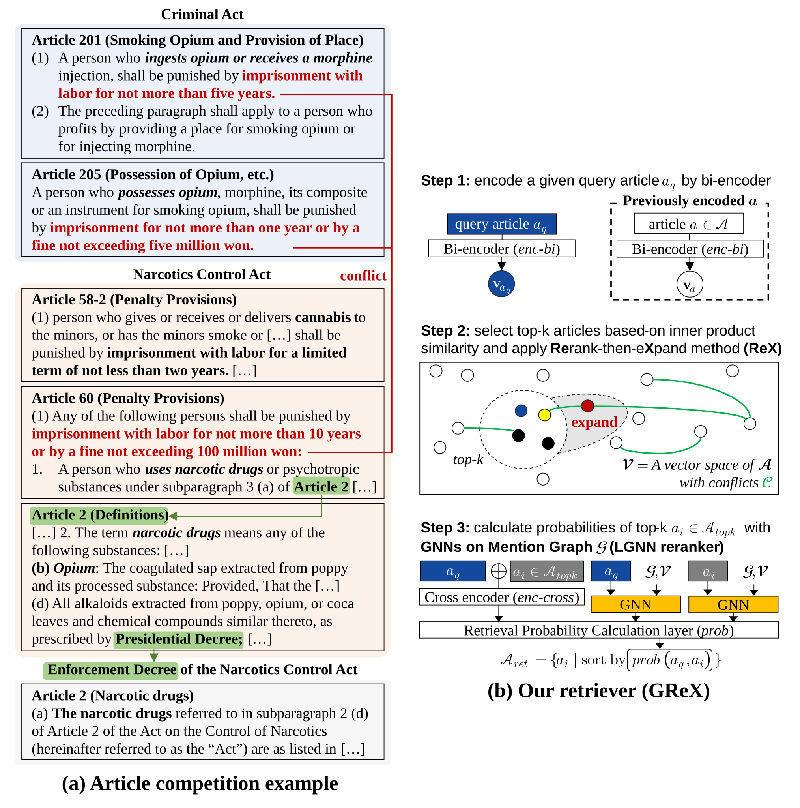

# Legal Article Conflict Detection (LACD)

An official repository for *GReX: A Graph Neural Network-based Rerank-then-Expand Method for Detecting Legal Article Conflict in Korean Criminal Law* paper.



## Installation

### **Virtual environment**

```bash
conda create -n lacd python=3.9
conda activate lacd
pip install -r requirements.txt
```

Before you start, make sure your default python execution path is our base directory. To do this, you should execute `export PYTHONPATH=.` in each terminal.


### **Law download**

Please locate provided law corpus data in `/data`.

### **Setting SEED value (optional)**

You can change the seed value by changing following codes in `/src/utils/utils.py` file.

```python
SEED = 42

def article_key_function(text)->str:
    import re
    #...
```

## Train

### Bi-encoder prepare

```bash
# Pretrained baseline model (no fine-tuning)
python ./src/encoders/bi_encoder/train/finetune.py --model monologg/kobigbird-bert-base --mode train --epoch 0 --tag kbb-baseline-nofinetune

# Naïve Re2 bi-encoder (original GReX loss: BCE on cosine)
python ./src/encoders/bi_encoder/train/finetune.py --model monologg/kobigbird-bert-base --mode train --tag kbb-baseline

# Ours (Case Augmentation)
python ./src/encoders/bi_encoder/train/finetune.py --model monologg/kobigbird-bert-base --mode train --tag kbb-caseaug --method case-augmentation

# InfoNCE with temperature (optional, default is original BCE)
# --biencoder_loss {default|bce|infonce}
# --infonce_tau  temperature for InfoNCE (recommended: 0.05)
python ./src/encoders/bi_encoder/train/finetune.py --model monologg/kobigbird-bert-base --mode train --tag kbb-infonce --biencoder_loss infonce --infonce_tau 0.05

# GNN bi-encoder (LawGNN)
python ./src/methods/LawGNN/train/biencoder_finetune.py --chroma_db_name kbb-baseline-nofinetune --gnn_method gat --biencoder_loss infonce --infonce_tau 0.05 --tag kbb-gat-infonce

# Debug mode - limited samples, fast smoke test for low VRAM
python ./src/encoders/bi_encoder/train/finetune.py --model monologg/kobigbird-bert-base --mode train --tag kbb-baseline-debug --debug --debug_limit 20 --batch_size 1 --max_length 512 --fp16 --gradient_checkpointing
```

The model will be saved in `/data/models/LACD-bi/kbb-baseline-nofinetune`. 
<!-- Alternatively, you can use provided model checkpoints. -->

### Build Chroma DB from scratch

By executing following codes, Chroma DBs are automatically built.

```bash
# Naïve Re2 bi-encoder chroma DB (kbb-baseline-nofinetune)
python ./src/main.py --biencoder_model_path ./data/models/LACD-bi/kbb-baseline-nofinetune --chroma_db_name kbb-baseline-nofinetune --retrieval_method retrieval

# Ours bi-encoder chroma DB (kbb-caseaug)
python ./src/main.py --biencoder_model_path ./data/models/LACD-bi/kbb-caseaug --chroma_db_name kbb-caseaug --retrieval_method retrieval

# Debug (inference single article, no benchmark loop - fast)
python ./src/main.py --biencoder_model_path ./data/models/LACD-bi/kbb-baseline-nofinetune --chroma_db_name kbb-baseline-nofinetune --retrieval_method retrieval --biencoder_top_k 2
```

Chroma DBs are saved in `/data/database/chroma_db`. Note that it takes amount of time (around ~20 minutes for eight Nvidia TITAN RTX GPUs).

### Cross encoder train

```bash
# baseline (Re2) cross-encoder
python ./src/encoders/cross_encoder/train/finetune-balanceWeight.py --mode train --tag roberta-0 --method baseline --model klue/roberta-base --epoch 10 

# Our LGNN cross-encoder
python ./src/methods/LawGNN/train/crossencoder_finetune.py --mode train --model klue/roberta-base --tag roberta-gat-0 --gnn_method gat --epoch 10 --chroma_db_name kbb-baseline-nofinetune 
```

Without `--model` option, our code trains `klue/roberta-base` model. After training, the models are saved in `/data/models/LACD-cross`.
These codes are all provided in `/bash-files/cross-encoder/all-train.sh`. 
<!-- Alternatively, you can use provided model checkpoints -->

## Test

### Main Results: retrieve competing articles in the LACD dataset

You can conduct main experiments by using following codes:

```bash
# Re2 retriever
python ./src/main.py --crossencoder_model_path ./data/models/LACD-cross/roberta-0 --retrieval_method re2 --crossencoder_index_method none --mode test-benchmark --biencoder_top_k 150 --output_path ./outputs/retrieval_results/article_key/re2-0.jsonl

# GReX retriever
python ./src/main.py --crossencoder_model_path ./data/models/LACD-cross/gnns/roberta-gat-0 --retrieval_method re2 --crossencoder_index_method gat  --rex_method rex2 --mode test-benchmark --output_path ./outputs/retrieval_results/article_key/grex-0.jsonl

# CAM-Re2
python ./src/main.py --crossencoder_model_path ./data/models/LACD-cross/gnns/kbb-baseline-gat-caseaugembds --biencoder_model_path ./data/models/LACD-bi/kbb-caseaug --chroma_db_name kbb-caseaug --retrieval_method re2 --crossencoder_index_method gat --rex_method rex2

# Debug - benchmark on 5 samples only, output -> outputs/retrieval_results/*_debug.jsonl
python ./src/main.py --crossencoder_model_path ./data/models/LACD-cross/roberta-0 --chroma_db_name kbb-baseline-nofinetune --retrieval_method re2 --crossencoder_index_method none --mode test-benchmark --debug --debug_limit 5

# Custom output directory to avoid overwriting across experiments
python ./src/main.py --crossencoder_model_path ./data/models/LACD-cross/roberta-0 --chroma_db_name kbb-baseline-nofinetune --retrieval_method re2 --crossencoder_index_method none --mode test-benchmark --output_dir ./outputs/my_experiment --output_name my_run

# Debug - classical retrievers (no GPU, fastest)
python ./src/main.py --chroma_db_name kbb-baseline-nofinetune --retrieval_method tfidf --biencoder_top_k 2
python ./src/main.py --chroma_db_name kbb-baseline-nofinetune --retrieval_method bm25 --biencoder_top_k 2
python ./src/main.py --chroma_db_name kbb-baseline-nofinetune --retrieval_method tfidf --mode test-benchmark --debug --debug_limit 5
```

Alternatively, you can execute `/bash-files/retrieval/retrieve-benchmark.sh`

### Evaluating retrieval results

You can evaluate results by following codes:
```bash
# Article post-processing (key normalization)
python ./src/eval/data-key-refine.py --input_dir ./outputs/retrieval_results/article_key --output_dir ./outputs/retrieval_results/article_key

# Benchmark evaluation table (nDCG@k, Recall@k, F1@k)
python ./src/eval/retrieval_eval.py --benchmark

# Single file evaluation (Precision, Recall, F1)
python ./src/eval/retrieval_eval.py --result_path ./outputs/retrieval_results/article_key/grex-0.jsonl --top_k 5

# Whole directory evaluation with metrics JSON output
python ./src/eval/retrieval_eval.py --result_path ./outputs/my_experiment --top_k 5 --metrics_output ./outputs/my_experiment/metrics.json
```

### Pipeline orchestrator (recommended for clean experiments)

Run all 5 steps with one command — consistent tags and no typos, supports both subset and full data:

```bash
# Subset (10k laws, ~4 min)
python run_pipeline.py --exp grex-10k --subset_laws 10000 --epoch 2 --max_length 512 --fp16

# Full data (79k laws, ~60 min) — final paper result
python run_pipeline.py --exp grex-full --epoch 3

# With explicit metrics and custom output dir (auto-created, overwritten if exists)
python run_pipeline.py --exp grex-10k --subset_laws 10000 --epoch 2 --max_length 512 --fp16 --output_dir ./outputs/grex-10k-gat

# InfoNCE loss via pipeline
python run_pipeline.py --exp grex-infonce --subset_laws 10000 --epoch 2 --max_length 512 --fp16 --biencoder_loss infonce --infonce_tau 0.05

# Rerun only retrieval + eval (e.g., after changing top_k)
python run_pipeline.py --exp grex-10k --subset_laws 10000 --steps 4,5 --top_k 5

# Dry run to preview commands without executing
python run_pipeline.py --exp grex-10k --subset_laws 10000 --dry_run
```
Outputs are collected under `--output_dir` (default `./outputs/{exp}`) as `metrics-bi.json`, `metrics-cross.json`, `metrics-retrieval.json`, and aggregated `summary.json`.

### ReX by synthetic C

To evaluate ReX using synthetic C, use following codes:

```bash
# Generate C using Re2
python ./src/main.py --crossencoder_model_path ./data/models/LACD-cross/roberta-0 --retrieval_method re2 --crossencoder_index_method none --mode train-generate --biencoder_top_k 100 --output_path ./outputs/retrieval_results/generative-conflicts/re2-0

# Generate C using GAT
python ./src/main.py --crossencoder_model_path ./data/models/LACD-cross/gnns/roberta-gat-0 --retrieval_method re2 --crossencoder_index_method gat --mode train-generate --biencoder_top_k 100 --output_path ./outputs/retrieval_results/generative-conflicts/re2-gat-0

# ReX using synthetic C
python ./src/main.py --crossencoder_model_path ./data/models/LACD-cross/roberta-0 --retrieval_method re2 --crossencoder_index_method none  --rex_method rex2 --mode test-benchmark --output_path ./outputs/retrieval_results/article_key/re2-rex-train-generate-0 --rex_conflict train-generate

# GReX using synthetic C
python ./src/main.py --crossencoder_model_path ./data/models/LACD-cross/gnns/roberta-gat-0 --retrieval_method re2 --crossencoder_index_method gat  --rex_method rex2 --mode test-benchmark --output_path ./outputs/retrieval_results/article_key/grex-train-generate-0 --rex_conflict train-generate
```

### Other baselines in LACD

You can conduct Rocchio-PRF experiments by following codes:
```bash
python ./src/main.py --crossencoder_model_path ./data/models/LACD-cross/roberta-0 --retrieval_method re2 --crossencoder_index_method none  --rex_method rocchio --mode test-benchmark --output_path ./outputs/retrieval_results/article_key/rocchioprf_re2-0 --biencoder_top_k 150

python ./src/main.py --crossencoder_model_path ./data/models/LACD-cross/gnns/roberta-gat-0 --retrieval_method re2 --crossencoder_index_method gat  --rex_method rocchio --mode test-benchmark --output_path ./outputs/retrieval_results/article_key/rocchioprf_gat-0 --biencoder_top_k 150
```

### GNN architectures comparison

You can check alternative GNN architectures (GCN, GraphSAGE, and GAT) by following code:

```bash
python ./src/methods/LawGNN/train/crossencoder_finetune.py --tag kbb-baseline-gcn-caseaugembds --gnn_method gcn --chroma_db_name kbb-caseaug --case_augmentation_method baseline --epoch 3

python ./src/methods/LawGNN/train/crossencoder_finetune.py --tag kbb-baseline-graphsage-caseaugembds --gnn_method graphsage --chroma_db_name kbb-caseaug --case_augmentation_method baseline --epoch 3
```

### Subset sampling via arguments (fast yet representative — for thesis experiments)

> A **stratified**, **graph-aware** alternative to `--debug`. No need to create a new dataset, simply add arguments. Early-load 2-pass streaming (never loads 100% into RAM), deterministic via `--subset_seed` — `pass1` only counts `label/degree` (`indices`/`Counter`), `pass2` only loads `keep` (`Random(seed+label)` per class + `Random(seed)` final shuffle).

| Argument | Default | Effect |
|----------|---------|--------|
| `--subset_ratio 0.15` | `None` (full) | Early-load stratified fraction `(0,1]` for `train/val/test.jsonl` preserving `P(y=1)=12.8%` via `src/utils/utils.py`. E.g., `0.15` = `1399->209`, `469->70`. Statistically representative, unlike `--debug` `head(N)`. Deterministic across sessions. Alias: `--sample_ratio`, `--mini_ratio` (deprecated). |
| `--subset_laws 2000` | `None` (79k) | Early-load `LMGraph` `ArticleNetwork` `src/methods/LawGNN/article_network/article_network.py` — degree is computed first from `law_link`, then `laws.csv` is streamed keeping only `keep` with hub-preserving `50%` top-degree + `50%` random. `2000` nodes `~7.9k` edges vs `79k/339k` full. Chroma build `~4 min` vs `~60 min`. Alias: `--mini_laws`, `--law_nodes` (deprecated). |
| `--subset_seed 42` | `42` | Reproducible seed for both samplings above (`seed+label` per class). Alias: `--mini_seed` (deprecated). |
| `--output_dir ./outputs/retrieval_results` | `./outputs/retrieval_results` | Custom directory for `test-benchmark` results to avoid overwriting across experiments, e.g. `--output_dir ./outputs/my_experiment`. Auto-created. |
| `--output_name my_run` | `None` (auto) | Custom filename (without `.jsonl`) for retrieval results; if not set, auto-generated as `{biencoder_method}_{crossencoder_index_method}_{crossencoder_method}{suffix}.jsonl`. |

Subset outputs are automatically suffixed `_subset15_laws2000` to avoid overwriting full results, e.g., `*_subset15_laws2000.jsonl` (legacy `_mini*` still readable via alias).

**When to use which:**
* `debug` (`head`): bug smoke test, `<10s`, metrics **not** representative.
* `subset` (`stratified`): hyperparameter tuning (`tau/alpha/epoch`), GNN ablations, `Spearman Recall@50 >0.85` vs full, `~10x` faster.

```bash
# Bi-encoder training — subset 15% + 2k articles, 512 tokens, fp16 (4 min on 2GB GPU) — recommended default for thesis
python ./src/encoders/bi_encoder/train/finetune.py --model monologg/kobigbird-bert-base --mode train --tag kbb-mini15 --subset_ratio 0.15 --subset_laws 2000 --max_length 512 --fp16 --batch_size 4 --epoch 3

# Bi-encoder training — subset 10% for rapid sweeps
python ./src/encoders/bi_encoder/train/finetune.py --model monologg/kobigbird-bert-base --mode train --tag kbb-mini10 --subset_ratio 0.1 --subset_laws 2000 --max_length 512 --fp16 --batch_size 4 --epoch 1

# Build Chroma DB subset (2k articles only) — must use the same subset_laws as training to keep the graph consistent
python ./src/main.py --biencoder_model_path ./data/models/LACD-bi/kbb-mini15 --chroma_db_name kbb-mini --retrieval_method retrieval --subset_laws 2000

# Cross-encoder GNN training — subset 10%
python ./src/methods/LawGNN/train/crossencoder_finetune.py --tag kbb-gat-mini10 --gnn_method gat --chroma_db_name kbb-mini --case_augmentation_method baseline --epoch 3 --subset_ratio 0.1 --subset_laws 2000 --max_length 512 --fp16

# Benchmark — subset 20% (93 samples instead of 469) — 5x faster, still stratified
python ./src/main.py --crossencoder_model_path ./data/models/LACD-cross/gnns/kbb-gat-mini10 --biencoder_model_path ./data/models/LACD-bi/kbb-mini15 --chroma_db_name kbb-mini --retrieval_method re2 --crossencoder_index_method gat --rex_method rex2 --mode test-benchmark --subset_ratio 0.2 --subset_laws 2000
# output -> outputs/retrieval_results/*_subset20_laws2000.jsonl

# Classical retriever subset (no GPU, <10s)
python ./src/main.py --chroma_db_name kbb-mini --retrieval_method tfidf --subset_laws 2000 --subset_ratio 0.2 --mode test-benchmark

# Combine subset + debug for ultra-fast smoke test (5 samples drawn from the 15% stratified subset)
python ./src/main.py --chroma_db_name kbb-mini --retrieval_method re2 --subset_ratio 0.15 --subset_laws 2000 --mode test-benchmark --debug --debug_limit 5 --biencoder_top_k 2
```

> Tip: `subset` and `debug` can be combined. `subset_ratio` is applied first (stratified `209`), then `debug` takes `head(5)` from that subset. `mini_*` aliases remain functional but deprecated.

### Debug mode

All `src/main.py` runs support `--debug --debug_limit N` (default 5). In `test-benchmark` mode it slices `data/datasets/LACD-retrieval/queries.jsonl` to `N` samples and writes `*_debug.jsonl` to avoid overwriting full results. In `inference` mode use `--biencoder_top_k 2` or `tfidf`/`bm25` for the fastest check. `src/encoders/bi_encoder/train/finetune.py` also supports `--debug --debug_limit 20 --batch_size 1 --max_length 512 --fp16 --gradient_checkpointing` (slices train/val/test to 20 samples, forces epoch=1; defaults `batch_size 4`, `max_length 4096`, `fp16/gradient_checkpointing false` — use small values only for 2GB VRAM debugging).

